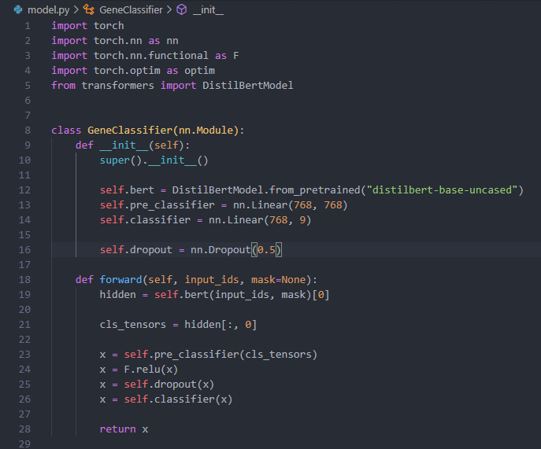
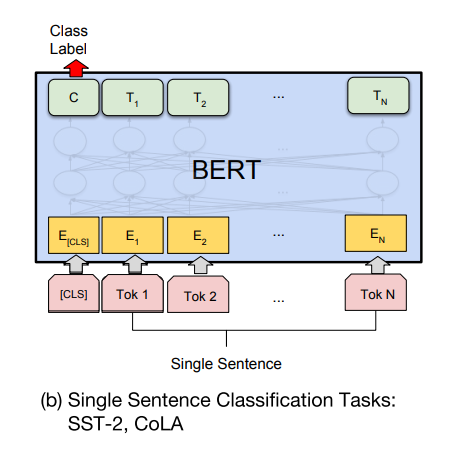
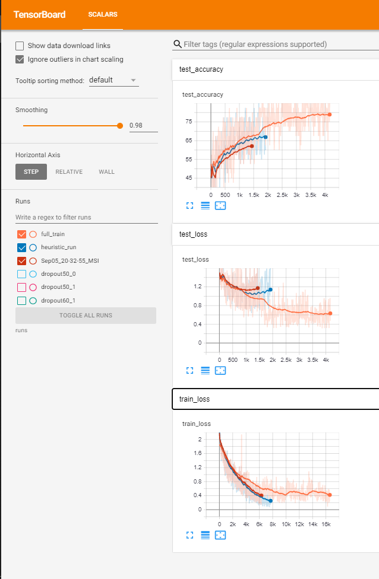
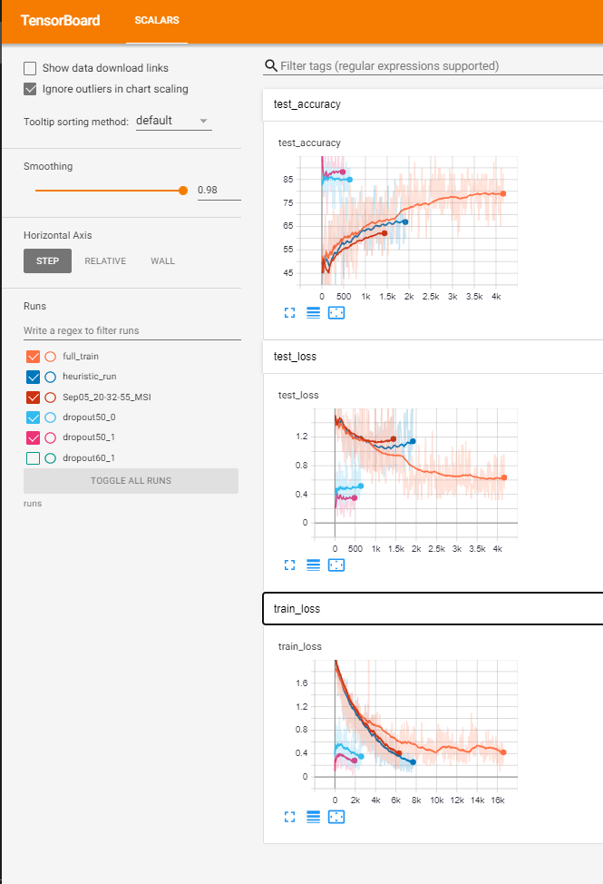

# Accelerating personalized medicine by leveraging deep learning
##### MedHacks2020
Project By: An Nan Pan, Bilun Sun, Mahad Janjua, Zheng Yu Cui

### Summary
Traditionally, people with the same type of cancer usually receive the same treatment, but in recent years, there has been more and more research on the specific effects of certain treatment options for people with certain genes. Some patients respond better to some treatment than others, whereas some treatments are not effective unless a mutation is present. The most classic example of this is HER2 receptor positive breast cancer, which is now most commonly treated with a monoclonal antibody like Herceptin. Keeping track of what the most recent literature says about different genes and mutations becomes more and more challenging with the increasing number of genes, mutations and publications.
Our project serves as the proof-of-concept for a solution to this issue. By using our online tool, researchers, healthcare workers and industry experts alike can easily input a scientific article and a mutation of interest to determine how it relates to other known mutations, so that they can rapidly recognize it as very dangerous or relatively benign. When evaluating a patient with a rare mutation that they haven’t seen before, a healthcare worker can quickly receive a predicted classification of the mutation based on published literature.
As sequencing technologies go down its declining cost curve and the population has easier access to their genetic data, this tool can be integrated to instantly give out warnings if a potentially dangerous mutation is detected. It will also always be kept up to date with the most recent literature so that patients have access to the best possible information.

### The data
We found a quality [dataset on kaggle](https://www.kaggle.com/c/msk-redefining-cancer-treatment/overview) from a past competition, where the goal is to classify clinically actionable genetic mutations. Essentially, given a gene, a mutation, and relevant text from clinical literature, the algorithm ought to classify the gene and its mutation into 1 of 9 classes.

### Our model

We decided to use DistilBertModel from 'huggingface' for its smaller memory footprint and faster inference speed compared to its teacher, BertModel.

> DistilBERT is a small, fast, cheap and light Transformer model trained by distilling Bert base. It has 40% less parameters than bert-base-uncased, runs 60% faster while preserving over 95% of Bert’s performances as measured on the GLUE language understanding benchmark. 
[HuggingFace](https://huggingface.co/transformers/model_doc/distilbert.html)

Moreover, we noticed a significant speed up when using the DistilBertTokenizerFast instead of the regular DistilBertTokenizer.
Nevertheless, if our neural network were to be deployed for real world use, we would certainly consider using a more performant model, such as BERT, RoBERTa or SciBERT (tailored for scientific papers), and train it on a cloud server with powerful GPUs.

We use DistilBertModel as our NLP backbone, then add two linear/dense/fully-connected layers on top of it, with a ReLU activation function and dropout. Note that similar to the single sentence classification task outlined in the BERT paper, we only apply the linear layers to the outputs corresponding to the CLS token.

### Sentence selection algorithm
 
Given that the research papers provided in the training dataset can contain upwards of 6 000 words or 10 000 tokens, we definitely had to employ heuristics to select for specific sentences as inputs to our neural network. Indeed, the standard number of tokens for a BERT model is 512, as described in the original paper. [BERT: Pre-training of Deep Bidirectional Transformers for
Language Understanding](https://arxiv.org/pdf/1810.04805.pdf)

While there is support from the 'huggingface' models to have up to 2048 tokens as inputs, we refrained from venturing in these waters as inference complexity increases quadratically with Transformers' attention mechanism.
Our current method for selecting sentences is to look for ones that contain the target mutation. Even then, we are still exceeding the 512 limit, but as our results showed, it does out-perform the naive approach of selecting the first 512 tokens. On top of that, we are probably losing crucial information in sentences where the mutation does not appear.
To improve the accuracy of the model, we would have liked to increase the number of tokens to at least 1024 and explore other heuristics, or perhaps consider using a better suited model, such as [DocBERT](https://arxiv.org/pdf/1904.08398.pdf), which can take in a document with an arbitrary length, as it is implemented with a [Bi-LSTM](https://arxiv.org/pdf/1904.08398.pdf).

In order to find the sentences that interest us the most, we first searched the text for mentions of the mutation of interest. If the number of tokens doesn’t exceed the maximum length, we would then proceed to add the text before and after to incorporate information that might be more related to the mutation in question. In cases where the mutation is not explicitly mentioned in the article, we would then search for the gene and try to find relevant information that way. 
We were expecting a decrease in training loss and an increase in test accuracy thanks to our sentence selection algorithm. As we trained the neural network, we observed that the training loss went down much quicker than before, and reached lower values in half the training steps! Nonetheless, to our dismay, the test accuracy looked like it was plateauing at 67%. That, combined with the fact that the test loss was gradually increasing, indicated that our model was unfortunately overfitting.

### Overfitting

Ever since [dropout](https://www.cs.toronto.edu/~hinton/absps/JMLRdropout.pdf) was introduced in the field of deep learning, it has been widely used across many disciplines. In short, when the activation of random neurons are inhibited, it seems to prevent the network from overfitting, as it cannot rely on specific pathways to memorize the training dataset. This is what we have tried with our model. We have increased the dropout rate (percentage of neurons to inhibit at each iteration) from 40% (in dark blue) to 50% (in dark red), but did not notice any significant improvement. If anything, the performance was slightly worse.

### Sudden improvement in the neural network’s performance

As we were exploring other options, such as L1 and L2 regularizations to penalize overly strong weights, we remembered that initialization can influence the performance of a neural network. As such, without changing any setting, we trained the model once more. To our great surprise, we achieved a much lower training loss, and a much better accuracy of 89% (in magenta and light blue). As aforementioned, we believed it was due to initialization. However, upon further thought, we came to the conclusion that initialization cannot account for such a drastic improvement. That is when we realized that we were actually loading the overfitting model, and training it with increased dropout, which made the model perform significantly better than before.

